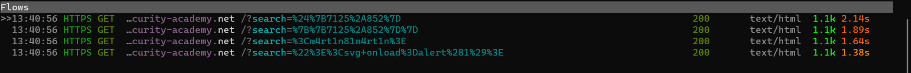

# Observer
A dynamical input penetration testing system based on Mitmproxy. This project strongly focuses on the detecting phase.

## Features:
 - Capture the attack surface (i.e save all endpoints that accept input)
 - Pick input for testing based on wordlist and pattern matching
 - Automatically run a suite of test cases based on yaml files
 - Detect , verify, and report security bugs

## Install
1.Clone the repo
```
git clone https://github.com/martin06061998/Observer.git
```
2.Install dependencies
```python
pip install -r requirements.txt
```
3.Install headless broswer to scrape dynamic websites
```python
playwright install chromium
```

## Usage
1.Start the proxy
```bash
mitmproxy -s main.py --allow-hosts https://example.com
```

2.Now, we can explore the attack surface manually or use a crawler to filter and forward traffic to the proxy 
```python
python xnLinkFinder.py -sp https://example.com -d 4 -i https://example.com -rp http://127.0.0.1:8080 -sf example.com -p 20 -u desktop
```
## Attack Vector Template Example

**Example 1**

Yaml file to detect PostgreSQL Injection based on response body content differences


```YAML
bug-name: "SQL Injection"
description: "detect Postgresql SQLi based on the response body content"
bug-type: "sqli"
target-arguments:
  - type: "word"
    part: "all"
    target: "name"
    words:
      - "url"
      - "report"
      - "role"
      - "update"
      - "query"
      - "user"
      - "name"
      - "where"
      - "search"
      - "params"
      - "process"
      - "view"
      - "table"
      - "from"
      - "sel"
      - "results"
      - "sleep"
      - "fetch"
      - "order"
      - "keyword"
      - "field"
      - "delete"
      - "string"
      - "number"
      - "filter"
      - "v"
      - "w"
      - "q"

  - type: "regex"
    target: "name"
    part: "all"
    regexes: 
      - "^.*(id|col|item|category|select|sort|row).*$"
number-of-flow: 3
flows:
  match-condition: "all"
  flow_1:
    payloads:
      - value: "'||'"
        position: "inject"
        tag: "postgresql"

    endpoint: "{{base_url}}"
    verify:
      - function: "has_similar_content_wordlist"
        args:
          body_content_1: "{{response_body_content!0}}"
          body_content_2: "{{response_body_content!1}}"
          rate: 93
        expected-value: True
  
  flow_2: # To avoid false positives 
    payloads:
      - value: "'+'"
        position: "inject"
        tag: "postgresql"

    endpoint: "{{base_url}}"
    verify:
      - function: "has_similar_content_wordlist"
        args:
          body_content_1: "{{response_body_content!0}}"
          body_content_2: "{{response_body_content!2}}"
          rate: 93
        expected-value: False
```
Results:

Mitmproxy:


Report


**Example 2**

```YAML
bug-type: "xss"
description: "detect reflected or DOM xss"
bug-name: "Reflected|Dom XSS"
number-of-flow: 2
target-arguments:
  - type: "word"
    part: "all"
    target: "name"
    words:
      - "q"
      - "s"
      - "search"
      - "lang"
      - "keyword"
      - "query"
      - "page"
      - "keywords"
      - "year"
      - "view"
      - "email"
      - "type"
      - "name"
      - "p"
      - "callback"
      - "jsonp"
      - "api_key"
      - "api"
      - "password"
      - "email"
      - "emailto"
      - "token"
      - "username"
      - "csrf_token"
      - "unsubscribe_token"
      - "id"
      - "item"
      - "page_id"
      - "month"
      - "immagine"
      - "list_type"
      - "url"
      - "terms"
      - "categoryid"
      - "key"
      - "l"
      - "begindate"
      - "enddate"
      - "v"
flows:
  flow_1:
    payloads:
      - value: "{{7125*852}}"
        position: "replace"
        tag: "xss"
      
      - value: "${7125*852}"
        position: "replace"
        tag: "xss"
      
      - value: "<m4rt1n81m4rt1n>"
        position: "replace"
        tag: "xss"
      
      - value: "\"><svg onload=alert(1)>"
        position: "replace"
        tag: "xss"

    verify:
      - function: "contain_any_patterns"
        args:
          patterns:
            - <m4rt1n81m4rt1n>
            - '6070500'
            - <svg onload=alert(1)>
        expected-value: True
```

Result:

Mitmproxy:



Report:


## TO DO:
 - Add automatic input-detecting functionality to the crawling service
